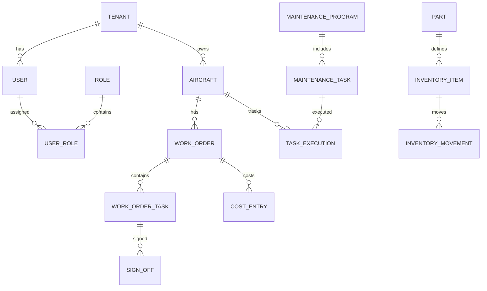

# ERD (Logical) — MVP Baseline

> This is a *logical* ERD for MVP baseline (CAMO + MRO + Logistics).
> Physical schema design will follow schema-per-tenant.

## Entity Notes
- All domain entities include `tenant_id` and audit fields.
- No hard deletes; use status-based lifecycle.

---
## ADDENDUM 2026-01 – PROD Auth & Multi-Tenancy (B1)

- Schema-per-tenant model **B1** adopted.
- Central ACL: `public.aircraft_mro_access`.
- `public.tenants.schema_name` is routing key.
- Keycloak is source of roles; DB maps permissions.
- `tenant_id` claim mandatory in access token (PROD).
